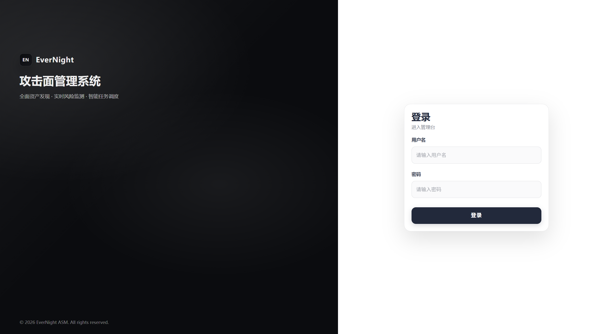

# EverNight ASM｜资产暴露面治理的新范式

> 当资产不可见，风险只能被动；当治理不可追溯，安全无法运营。  
> EverNight ASM 以“资产为第一性原理”，把暴露面管理从**扫描工具**升级为**组织级治理体系**。

---



## 01｜行业痛点：资产可见≠可治理

安全团队经常陷入三类困境：  
1) **资产不可见**：资产分散在业务线、云、供应商与临时项目中，缺少统一视图。  
2) **资产不可管**：即便扫描发现了，也缺少认领机制，责任不清、归属不明。  
3) **风险不可追**：风险被发现后缺少日志与复盘体系，复发难以识别。  

EverNight ASM 选择直面这些“根本性问题”，而非只在扫描层面“刷存在感”。

---

## 02｜我们解决的不是“扫描”，而是“治理”

传统扫描工具擅长“发现”，却回答不了关键问题：  
- **资产归属到底是谁？**  
- **新资产出现后如何被认领？**  
- **风险复发是否被及时捕获？**  
- **责任与修复是否可追溯？**  

EverNight ASM 的目标不是“扫更多”，而是建立**可持续、可追责、可运营**的治理闭环。

---

## 03｜场景故事：一次“资产复活”的真实治理路径

某企业在安全整改后标记了一批“已停用资产”。  
几周后，一台旧系统重新上线，传统扫描工具只能“再次扫描到”，但无法建立责任链路。  

在 EverNight ASM 中：  
1) 该资产被**复活机制**识别并入池  
2) 自动触发告警，标记“已停用资产复活”  
3) 责任人认领后进入资产库，风险评估重新触发  
4) 风险日志记录完整复活过程  

最终结果是：  
**资产可见 → 归属清晰 → 风险可追溯 → 治理可闭环**。

---

## 04｜产品哲学：以资产为中心的闭环系统

EverNight 将治理链路统一为一条可运营的闭环：

```
发现 → 待认领 → 资产库 → 评估 → 风险 → 告警/复验
```

每个环节都沉淀来源、归属、状态与历史，  
让安全工作从“报告输出”升级为“治理能力”。

---

## 05｜核心能力矩阵

### 资产可见（Discover）
- DNS / CT / 端口 / 搜索引擎四大扫描模块  
- 多源持续发现，覆盖主域到子域  
- 纯真 IP 预定位，认领更高效  

### 资产可管（Own）
- 扫描结果先入**待认领池**，拒绝无归属资产入库  
- 归属确认后进入资产库，责任清晰  
- 认领动作与来源全量记录  

### 风险可追（Assess）
- 低流量评估策略，尽量降低生产影响  
- 高危端口 / 管理路径 / 敏感路径 / 指纹识别  
- 风险日志 + 复活机制，形成闭环追踪  

### 运营可控（Operate）
- 资产 / 风险双态势大屏  
- 任务中心统一调度与历史追踪  
- 完整日志与告警体系  

---

## 06｜内置机制与驱动

- **体系化去噪**：CDN / 泛解析 / 负载均衡 / Web 协议识别  
- **资产复活机制**：停用资产再次上线自动入池 + 告警  
- **指纹库体系化维护**：独立 CDN 指纹库 + Meppo 被动式高危指纹库  
- **SOC 预留接口**：三方资产列表调度对接能力
>因授权限制，Meppo被动式高危指纹库仅开放测试样例可自行维护，其它功能不受限制
---

## 07｜Docker 一键部署（生产级）

```bash
cd docker
docker-compose up -d
```

访问地址：`http://<IP>:7666`

---

## 08｜部署结构与配置说明

```
docker/
  backend/            # 后端 Dockerfile（放 app.jar）
  frontend/           # 前端静态文件 + nginx.conf
  mysql/init/         # 初始化 SQL（3 个）
  docker-compose.yml
```

**密码修改（生产必做）**  
编辑 `docker-compose.yml` 中：
```
MYSQL_ROOT_PASSWORD: 替换为强密码
MYSQL_PASSWORD: 替换为强密码
SPRING_DATASOURCE_PASSWORD: 同步替换
```

如需 Redis 密码，追加：
```
command: redis-server --appendonly yes --requirepass <你的密码>
```
并设置：
```
SPRING_DATA_REDIS_PASSWORD: <你的密码>
```

**数据库初始化文件**  
- `mysql/init/1-init.sql`（表结构 + 必需数据）  
- `mysql/init/2-dict.sql`（字典）  
- `mysql/init/3-finger.sql`（指纹）  

---

## 09｜前后端构建命令

**后端（Spring Boot / JDK17）**
```bash
cd backend
mvn -DskipTests package
```

**前端（Vue3 / Vite / Element Plus）**
```bash
cd frontend
npm run build
```

将构建产物复制到：
- 后端 jar → `docker/backend/app.jar`
- 前端 dist → `docker/frontend/`

---

## 10｜技术栈说明
- **后端**：Spring Boot、MyBatis-Plus、Knife4j（开发环境）  
- **前端**：Vue 3、Vite、Element Plus  
- **数据**：MySQL 8、Redis 7  

---

## 11｜价值

**安全治理不是一次行动，而是一种组织能力。**  
EverNight ASM 让资产成为安全治理的“可运营资产”，  
让每一次扫描、每一次告警、每一次修复都沉淀为可复盘、可追责的体系能力。

---

## 12｜结语

EverNight ASM 不是一个扫描器，  
而是一套让资产“可见、可管、可追溯”的治理范式。  

当资产成为安全的第一性原理，  
你将拥有真正可运营、可复盘、可持续的安全能力。  

